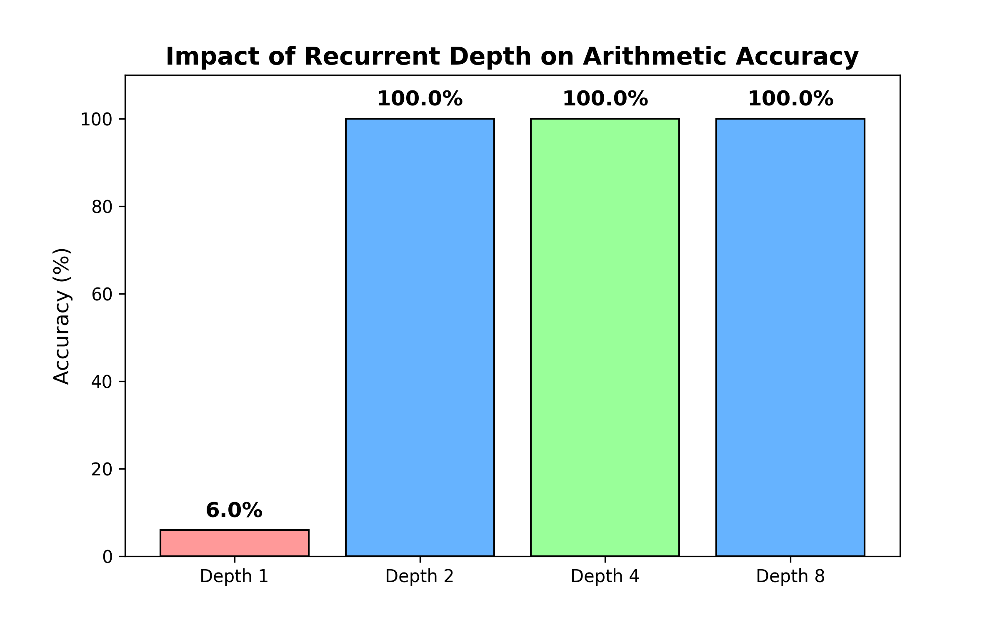

# Scaling Test-Time Compute with Latent Reasoning (Implementation)

This repository contains a PyTorch implementation of **Recurrent Depth Scaling**, inspired by the paper *"Scaling up Test-Time Compute with Latent Reasoning"* (arXiv:2502.05171).

### The Goal
Standard LLMs use a fixed amount of compute per token. This project implements a **Recurrent GPT** where a single Transformer block is looped `k` times. By training with randomized depths, the model learns to refine its latent state iteratively.

### Key Result
I trained a 30M parameter model on 2-digit addition tasks. The model shares weights across iterations.
**Without retraining**, increasing the inference depth drastically improves performance.

The chart below demonstrates the core finding: **At Depth 1, the model fails (8% accuracy). At Depth 2+, it "thinks" long enough to solve the carry operations perfectly.**



| Inference Depth | Accuracy | Status |
|-----------------|----------|--------|
| **Depth 1**     | 6.0%     | Fails to carry logic |
| **Depth 2**     | **100.0%** | Converges on correct answer |
| **Depth 4**     | 100.0%   | Stable |

This demonstrates that **Test-Time Compute** can substitute for model size.

**Remember results might differ from mine.**


### Technical Details
- **Architecture**: Decoder-only Transformer with Recurrent Depth.
- **Mechanism**: A shared `TransformerBlock` is applied `k` times in a loop during the forward pass.
- **Training**: Randomized depth (1-8 iterations) per batch to enforce stability.
- **Hardware**: Trained on Apple M-Series GPU (MPS).

### Usage
```python
# To replicate the experiment:
python train.py